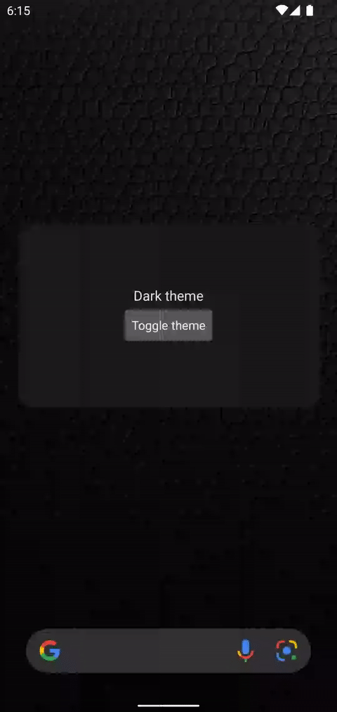
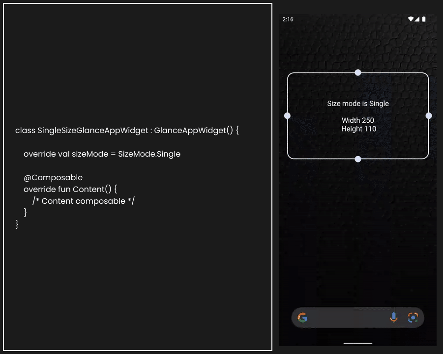
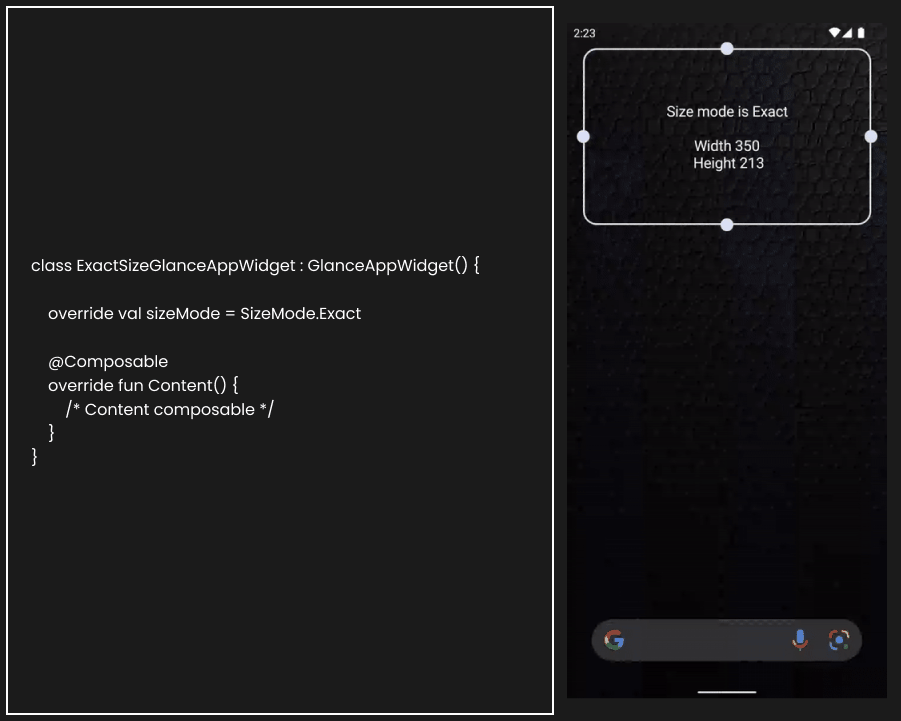
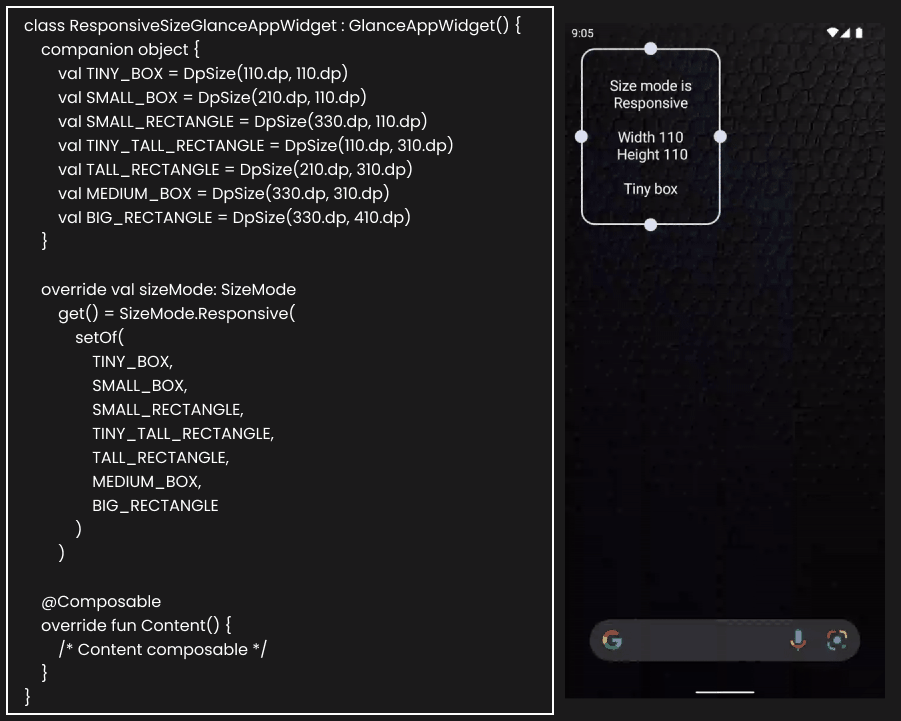

## Glance

### Medium post
https://medium.com/@sridhar-sp/android-app-widgets-with-glance-9e881f40c636

### Media widget

See demo

See architecture diagram for media widget

### Stateful widget

See demo

### SizeMode.Single widget

See demo

### SizeMode.Exact widget

See demo

### SizeMode.Responsive widget

See demo

